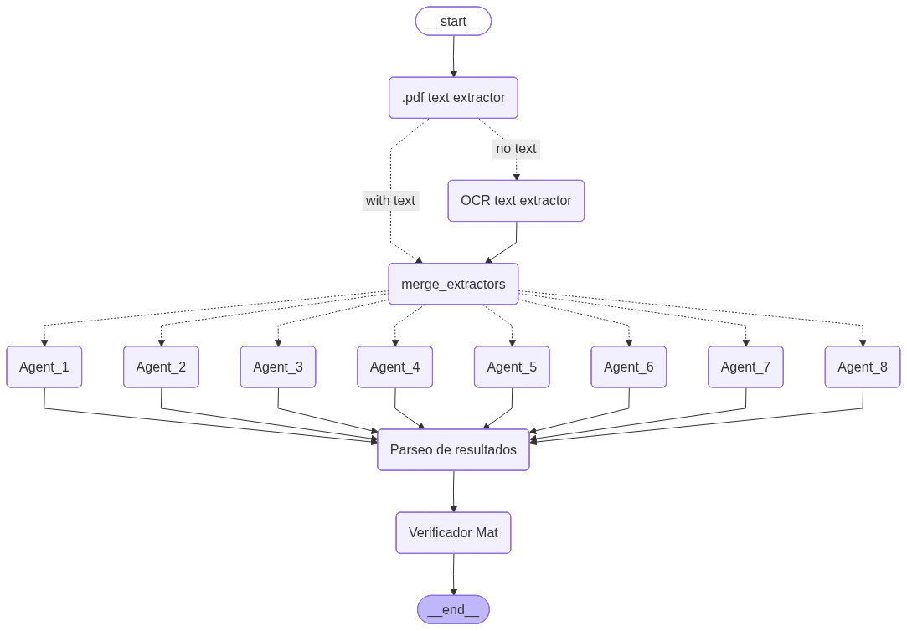

ASK FOR CODE: ferbonve@gmail.com

> [!NOTE]
> This README was written with AI assistance for documentation purposes only. The the ensemble design, the conditional OCR routing, the mathematical validator and the full implementation was conceived and coded by 50% of me. LLMs were used to save time writing the docs, and support .

# 🧾 Invoice Parser - Multi Agent LLM System

An **LLM ensemble system** for automatically extracting fiscal data from PDF invoices. Built with **LangGraph**, it runs multiple agents in parallel over a single text source and aggregates their outputs. It processes batches of documents (invoices, debit/credit notes, receipts) and returns structured JSON per invoice.

Como los modelos de lenguaje pueden alucinar valores numéricos, diseñé el sistema para ejecutar múltiples agentes en paralelo, aplicar una instancia de votación entre los resultados de los agentes y sumar una capa de validación matemática que verifica la consistencia de los totales antes de dar un resultado por válido.

---

## 🎯 What problem does it solve?

Manually entering invoices into an accounting system is slow and error‑prone. This agent automates extraction of all relevant fiscal fields for Argentina (taxable bases by VAT rate, VAT amounts, perceptions) and verifies that numbers are mathematically consistent before marking them as valid.

---

## 🏗️ Architecture


### How the ensemble works

Extraction is now a **routing decision**, not two parallel sources. Each invoice starts with **pdfplumber** text extraction, and a conditional edge decides the path:

- **`with text`** → the PDF already contains embedded text, so that text is used directly and OCR is skipped.
- **`no text`** → the PDF has no usable embedded text, so the invoice is routed to **DocTR OCR**.

Both branches reconverge at **`merge_extractors`**, which hands a **single text source** to the agent layer. This avoids running OCR unnecessarily on text‑based PDFs (faster, cheaper) while still handling scanned documents.

The agent layer runs **8 agents in parallel**:

- **6 text‑based agents** read the extracted text, with **temperature variation** for controlled diversity.
- **2 multimodal agents** read the PDF directly as an image (no text extraction needed), which helps recover fields that get lost in OCR/text parsing.

This yields **8 independent extractions per invoice**, which are then parsed, normalized and validated.

```
1 PDF
   │
   ▼
.pdf text extractor  (pdfplumber)
   │
   ├── with text ──────────────────┐
   │                                ▼
   └── no text → OCR text extractor (DocTR)
                                    │
                                    ▼
                            merge_extractors
                                    │
                    ┌───────────────┴───────────────┐
              6 text agents                   2 multimodal agents
              (temperature variation)         (read the PDF as image)
                    └───────────────┬───────────────┘
                                    │
                          Parseo de resultados
                          (parse + normalize + consensus)
                                    │
                                    ▼
                            Verificador Mat
                          (mathematical validation)
                                    │
                                    ▼
                                 result
```

The temperature variation across the text agents introduces controlled diversity in the outputs, similar to how ensemble methods in ML use multiple models or random seeds to reduce variance and improve robustness.

### Mathematical validator (implemented)

After parsing, the **`Verificador Mat`** node checks each extraction for internal consistency before it is accepted:

- `iva_21 ≈ neto_gravado_21 × 0.21`
- `iva_1050 ≈ neto_gravado_1050 × 0.105`
- `iva_27 ≈ neto_gravado_27 × 0.27`
- `neto_total ≈ sum of all net components`
- `total ≈ neto_total + all VATs + all withholdings`

Extractions that fail validation are flagged (`errores_validacion`) and marked `valido: False`, so inconsistent numbers don't make it into the final result unchecked.

---

## 📊 Output per invoice

```python
{
  'moneda': 'ARS',
  'confidence': 'high',
  'neto_total': 64236.81,
  'neto_gravado_21': 64236.81,
  'neto_gravado_1050': None,
  'neto_gravado_27': None,
  'no_gravado': None,
  'iva_21': 13489.73,
  'iva_1050': None,
  'iva_27': None,
  'percepciones_iva': None,
  'percepciones_ganancias': None,
  'percepciones_iibb': None,
  'total': 77726.54,
  'errores_validacion': [],
  'valido': True,
  'FileName': '2026-02-01_..._BONVECCHIATO.pdf'
}
```

---

## ✨ Features

- **Conditional extraction**: pdfplumber first, DocTR OCR only when the PDF has no embedded text (routed by a conditional edge).
- **LLM ensemble**: 8 agents per invoice (6 text‑based + 2 multimodal) → 8 independent extractions.
- **Variable temperature**: controlled output diversity across the text agents.
- **Multimodal agents**: process the PDF directly as an image, no text extraction needed.
- **Mathematical validator**: each extraction is checked for internal consistency of nets, VATs and totals before being marked valid.
- **Number normalization**: auto-detects and converts Argentine (`1.234,56`) and US (`1,234.56`) formats.
- **Batch processing**: process entire folders.
- **Excel export**: direct output to `.xlsx`.

---

## 📋 Extracted Fields

| Field | Description |
|---|---|
| `moneda` | Invoice currency (ARS, USD, etc.) |
| `neto_total` | Net subtotal / total before taxes |
| `neto_gravado_21` | Taxable base at 21% VAT rate |
| `neto_gravado_1050` | Taxable base at 10.5% VAT rate |
| `neto_gravado_27` | Taxable base at 27% VAT rate |
| `no_gravado` | Exempt / non-taxable amounts |
| `iva_21` | VAT at 21% |
| `iva_1050` | VAT at 10.5% |
| `iva_27` | VAT at 27% |
| `percepciones_iva` | VAT withholdings |
| `percepciones_ganancias` | Income tax withholdings |
| `percepciones_iibb` | Gross income tax withholdings |
| `total` | Total invoice amount |
| `valido` | Whether the extraction passed mathematical validation |
| `errores_validacion` | List of consistency checks that failed (empty if valid) |
| `confidence` | Overall extraction confidence (`high / medium / low`) |

---

## 🛠️ Installation

### Requirements

- Python 3.10+
- [Groq](https://console.groq.com/) account (API key)
- [Google AI Studio](https://aistudio.google.com/) account (API key for Gemini)

### Dependencies

```bash
pip install langchain-core langchain-groq langchain-google-genai
pip install langgraph
pip install pdfplumber
pip install python-doctr[torch]   # or [tf] if you prefer TensorFlow
pip install pandas openpyxl
```

### Configuration

Set your API keys as environment variables:

```bash
export GROQ_API_KEY="your-groq-api-key"
export GOOGLE_API_KEY="your-google-api-key"
```

Then read them in the script:

```python
import os
groq_api_key = os.environ["GROQ_API_KEY"]
google_api_key = os.environ["GOOGLE_API_KEY"]
```

---

## 🚀 Usage

### Process a single invoice

```python
result = app.invoke({
    "messages": [HumanMessage(content="Extract the data from this invoice:")],
    "pdf_path": "path/to/your/invoice.pdf",
    "agents_config": AGENTS_CONFIG
})

# Export to Excel
df = pd.DataFrame(result["resultados_parseados_etapa2"])
df.to_excel("result.xlsx", index=False)
```

### Batch processing

```python
from pathlib import Path

folder_path = "path/to/invoices/folder"
pdf_files = [str(p) for p in Path(folder_path).glob("*.pdf")]

inputs = [
    {
        "messages": [HumanMessage(content="Extract the data from this invoice:")],
        "pdf_path": pdf_path,
        "agents_config": AGENTS_CONFIG
    }
    for pdf_path in pdf_files
]

results = app.batch(inputs, config={"max_concurrency": 3})
```

---

## 📁 Project Structure

```
invoice-parser/
│
├── facturas_parser.py                      # Main script
├── facturas_parser_system_prompt_v2.txt    # LLM system prompt (shared by the agents;
│                                           #   role-specialized prompts are on the roadmap)
├── graph.png                               # LangGraph architecture diagram
├── README.md
│
├── invoices/                               # PDF input folder (not included in repo)
│   └── *.pdf
│
└── results.xlsx                            # Generated output (not included in repo)
```

---

## ⚙️ Agent Configuration

The 8 agents are configured here. The example below is illustrative — adjust the
temperatures, prompt paths and multimodal flags to match your actual setup.

```python
AGENTS_CONFIG = {
    # Text-based agents (read the single merged text source)
    "agent_1": {"temperature": 0.0, "prompt_path": "path/to/prompt.txt"},
    "agent_2": {"temperature": 0.2, "prompt_path": "path/to/prompt.txt"},
    "agent_3": {"temperature": 0.4, "prompt_path": "path/to/prompt.txt"},
    "agent_4": {"temperature": 0.0, "prompt_path": "path/to/prompt.txt"},
    "agent_5": {"temperature": 0.2, "prompt_path": "path/to/prompt.txt"},
    "agent_6": {"temperature": 0.4, "prompt_path": "path/to/prompt.txt"},
    # Multimodal agents (read the PDF directly as an image)
    "agent_7": {"temperature": 0.0, "multimodal": True, "prompt_path": "path/to/prompt.txt"},
    "agent_8": {"temperature": 0.2, "multimodal": True, "prompt_path": "path/to/prompt.txt"},
}
```

Groq models are tried in order, with automatic fallback on rate limit errors:

```python
models = [
    "llama-3.3-70b-versatile",
    "meta-llama/llama-4-scout-17b-16e-instruct",
    "llama-3.1-8b-instant",
    ...
]
```

---

## 📦 Models Used

| Provider | Models | Usage |
|---|---|---|
| Groq | LLaMA 3.3 70B, LLaMA 4 Scout, LLaMA 3.1 8B | Text-based extraction (6 agents) |
| Google Gemini | gemini-2.5-flash | Multimodal extraction directly from PDF (2 agents) |

### 🛠️ Stack

| Tool | Role |
|---|---|
| LangGraph | Graph‑based agent orchestration + conditional routing |
| Groq | High‑speed LLM inference |
| LangChain Core | Message types and abstractions |
| pdfplumber | PDF text extraction |
| DocTR | OCR fallback for scanned / no‑text PDFs |
| pandas / openpyxl | Excel export |

---

## 🗺️ Roadmap

### Consensus / voting layer

Aggregate the 8 validated extractions into a single final result. The planned approach prioritizes mathematically valid extractions and uses **majority voting** or **median values** for numeric fields where agents disagree.

### Role-specialized agents

Move from a single shared system prompt to **different roles per agent** (e.g. one focused on VAT bases, one on withholdings, one on totals) to improve accuracy where fields are commonly confused.
